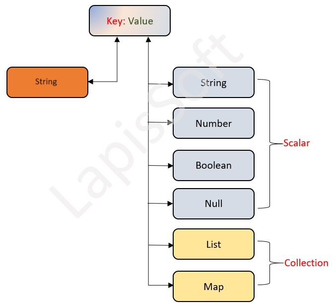
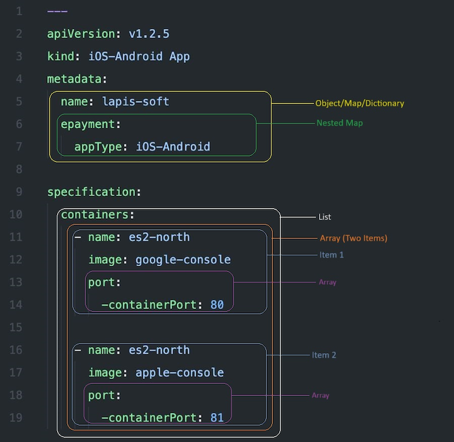

[![LinkedIn][linkedin-shield-lapissoft]][linkedin-url-lapissoft]
[![Facebook-Page][facebook-shield-lapissoft]][facebook-url-lapissoft]
[![Youtube][youtube-shield-lapissoft]][youtube-url-lapissoft]

<h3 align="center">
   Visit Us <a href="http://www.lapissoft.com">Lapis Soft</a>
</h3>

### Yet Another Markup Language (YAML)

YAML Ain't Markup Language (YAML) is a data serialization language that is consistently listed as one of the most popular programming languages. It's often used as a format for configuration files, but its object serialization abilities make it a viable replacement for languages like JSON. This YAML tutorial will demonstrate the language syntax with a guide and some simple coding examples in Python. YAML has broad language support and maps easily into native data structures. It's also easy for humans to read, which is why it's a good choice for configuration. The YAML acronym was shorthand for Yet Another Markup Language.

|  SL   | Notation | Functionality                                        |
| :---: | :------: | :--------------------------------------------------- |
|   1   |    :     | It is use to key-value pair (mapping) presentation   |
|   2   |    -     | It is use to entry of the block sequence.            |
|   3   |    ,     | It is use to describes the entry of flow collection. |
|   4   |    ?     | It is use to Describe the mapping key.               |
|   5   |    !     | It is use to Describes the tag of a node.            |
|   6   |    &     | It is use to anchor property of a node.              |
|   7   |    \|    | It is use to literal block scalar.                   |
|   8   |    #     | It is use to describe the comments.                  |
|   9   |    >     | It is use to describe the folded block scalar.       |
|  10   |    {     | It is use to start the mapping of flow.              |
|  11   |    }     | It is use to end the mapping of flow.                |
|  12   |    [     | It is use to start the sequence of flow.             |
|  13   |    ]     | It is use to end the sequence of flow.               |
|  14   |    %     | It is use to describes the use of directives.        |
|  15   |   ---    | It is use to stream Staring                          |
|  16   |   ...    | It is use to stream ending                           |
|  17   |    \*    | It is use to describe the alias node.                |

## YAML Datatype

There are three types of types in YAML shown as follows;

<ol>
  <li>Scalars</li>
  <li>Mappings</li>
  <li>Sequences</li>
</ol>

See in details in class (03 to 06)

Object-Map-Dictionary-Array-List

## Courtesy of Jakir,

[![LinkedIn][linkedin-shield-jakir]][linkedin-url-jakir]
[![Facebook-Page][facebook-shield-jakir]][facebook-url-jakir]
[![Youtube][youtube-shield-jakir]][youtube-url-jakir]

### Have a good day, stay with me
<!-- Personal profile -->

[linkedin-shield-jakir]: https://img.shields.io/badge/linkedin-%230077B5.svg?style=for-the-badge&logo=linkedin&logoColor=white
[linkedin-url-jakir]: https://www.linkedin.com/in/jakir-ruet/
[facebook-shield-jakir]: https://img.shields.io/badge/Facebook-%231877F2.svg?style=for-the-badge&logo=Facebook&logoColor=white
[facebook-url-jakir]: https://www.facebook.com/jakir-ruet/
[youtube-shield-jakir]: https://img.shields.io/badge/YouTube-%23FF0000.svg?style=for-the-badge&logo=YouTube&logoColor=white
[youtube-url-jakir]: https://www.youtube.com/@mjakaria-ruet/featured

<!-- Company profile -->

[linkedin-shield-lapissoft]: https://img.shields.io/badge/linkedin-%230077B5.svg?style=for-the-badge&logo=linkedin&logoColor=white
[linkedin-url-lapissoft]: https://www.linkedin.com/company/lapis-soft/
[facebook-shield-lapissoft]: https://img.shields.io/badge/Facebook-%231877F2.svg?style=for-the-badge&logo=Facebook&logoColor=white
[facebook-url-lapissoft]: https://www.facebook.com/GoLapisSoft/
[youtube-shield-lapissoft]: https://img.shields.io/badge/YouTube-%23FF0000.svg?style=for-the-badge&logo=YouTube&logoColor=white
[youtube-url-lapissoft]: https://www.youtube.com/@LapisSoft/featured

